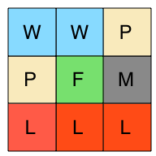
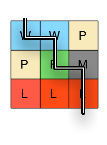

# Part 2: Work with a collection

## Summary

In this part of the assessment, we are going to be working with a collection of objects. We've been provided two classes and the specs that describe the behaviors of the classes.

### What are we building?

We'll be building a `GameBoard` class to represent the game board of a table top game. For our purposes, a game board is a square board of terrain tiles. Each tile can be "water", "plains", "forest", "lava" or "mountains".

Here's a 3x3 board of different tiles:

```text
Water  Water  Plains
Plains Forest Mountains
Lava   Lava   Lava
```

In your head you could visualize it like this:



### Classes
#### `TerrainHelper`
The `TerrainHelper` class has been written for us. It will help us build our game board with some nice helper utilities, check it out.

Tests have been provided that describe what this class does. Take some time to examine the code and the specs side-by-side since we'll be using `TerrainHelper` later.


#### `GameBoard`
The `GameBoard` class is somewhat complete. We can initialize an instance of `GameBoard` with:

 * `terrain_list`, a flat list of terrain letters (ex. ["W", "P", "W"])
 * `size`, the board size
 * `terrain_helper`, a terrain helper

## Releases

## Release 0: `GameBoard#terrain_map`

Look at the tests. When our `GameBoard` is initialized it receives a flat list of terrain letters. For example: `["W","W","P","P","F","M","L","L","L"]`.

`GameBoard#terrain_map` will need to take those letters, convert them to terrain symbols, and lay them out on a 2D board with the dimensions `size` x `size`.

That means `["W","W","P","P","F","M","L","L","L"]` with size 3 will become:

```ruby
[
  [:water,  :water,  :plains],
  [:plains, :forest, :mountains],
  [:lava,   :lava,   :lava]
]
```

**Don't forget to read the existing code and specs before diving in.**

A group of tests is provided to describe how an instance of `GameBoard` behaves
when told to make a 2D map of terrain.  This group of tests is [tagged][]
`terrain\_map`.  To run the tests specific to the `#terrain_map` method, from
the root directory run:

```
rspec --tag terrain_map
```

The tests in the example group should be failing.  Update the `GameBoard` class in `game_board.rb` to make the tests pass.

*Do not modify the tests.*

## Release 1: `GameBoard#difficulty_of_journey`

In this release we need to write a method that takes a path across the board and determines how hard it will be. The difficulty will be the sum of the difficulty of each tile that is traversed.

As input, the method will take in a list of coordinates made up of `row` and `column` like so: `[[row, column], [row, column], [row, column]]`.

So if our method receives this list...
```ruby
[[0,0], [0,1], [1,1], [1,2], [2,2]]
```

... then it will need to return how difficult this path will be through the maze:



A group of tests is provided to describe how an instance of `GameBoard` behaves
when told to calclulate difficulty.  This group of tests is tagged
`difficulty`.  To run the tests specific to the `difficulty_of_journey` method, from the
root directory run:

```
rspec --tag difficulty
```

The tests in the example group should be failing.  Update the `GameBoard` class in `game_board.rb` to make the tests pass.

*Do not modify the tests.*


## Conclusion
Once all the specs have passed (`rspec spec`), you have completed Part 2 of the assessment. If you haven't done so already, commit your changes and move on to Part 3.

[tagged]: https://www.relishapp.com/rspec/rspec-core/v/2-4/docs/command-line/tag-option
